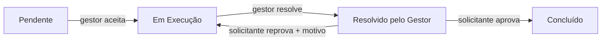

  

  Tecnólogo em Inteligência Artificial · Teresina, PI 🇧🇷

---

## Sobre mim

- Cursando **Tecnólogo em Inteligência Artificial** na **Faculdade PIT** (Piauí Instituto de Tecnologia)
- Atuo com **automação e suporte técnico**: scripts em Google Apps Script, integração com APIs, análise de logs, geração de relatórios e documentação interna
- Meu objetivo é ingressar no mercado de **desenvolvimento de software**
- Aprendo na prática: escrevo o código, erro, reviso e evoluo
- Estudando agora: **Engenharia de Dados** (Databricks, camadas bronze/silver) e **Machine Learning**
- Próximos passos: **React** e **Java**

---

## Projetos em destaque

### Sistema de Gestão de Chamados · *projeto profissional (código privado)*
Web App que desenvolvi do zero para a empresa onde trabalho, para organizar a abertura, o atendimento e a aprovação de solicitações de correção e suporte, substituindo trocas de e-mail por um fluxo rastreável. O código é de propriedade da empresa e não é público.

**O que o sistema faz**
- **Perfis de acesso**: ações exclusivas de gestor e aprovação restrita a quem abriu o chamado
- **Fila de atendimento por ordem de chegada (FIFO)**
- **Temporizadores em tempo real**: tempo em aberto e tempo de atendimento
- **Ciclo de aprovação com histórico**: aprovação ou reprovação com motivo e imagens anexadas
- **Alertas para o gestor** a cada chamado novo ou reprovação (som, notificação do navegador e título da aba)
- **Anexos de imagem** armazenados no Google Drive
- **Painel do gestor** para administrar sistemas/módulos e limpar chamados

**Desafios que resolvi**
- Evitar que dois usuários gravem ao mesmo tempo e sobrescrevam os dados um do outro (controle de concorrência)
- Validar regras de negócio no servidor, e não só na interface
- Separar o armazenamento de anexos em um projeto à parte, para o sistema principal não pedir permissões extras aos usuários

`Google Apps Script` `JavaScript` `HTML/CSS` `Google Drive` `Web Audio API` `Notification API`

---

### [Cofre de Senhas](https://github.com/RuanF2/cofre-de-senhas)
Gerenciador de senhas completo, com autenticação **JWT**, login com **Google OAuth** (Passport.js), criptografia **AES-256-GCM** e banco **PostgreSQL**.
`Node.js` `PostgreSQL` `JWT` `OAuth`

### Post+
Rede social full-stack com back-end em **Node.js/Express**, **PostgreSQL** e front-end em HTML, CSS e JavaScript puro.
`Node.js` `Express` `PostgreSQL` `JavaScript`

### AgroDash Brasil
Dashboard interativo com dados agrícolas dos **27 estados brasileiros**, tema neon e partículas animadas.
`JavaScript` `Chart.js` `HTML/CSS`
---

## O que faço no dia a dia

- Desenvolvimento de **sistemas internos** com Google Apps Script (como o sistema de chamados acima), com controle de acesso, concorrência e integrações
- Integração com **APIs REST** (paginação, filtros por data, mapeamento de dados)
- Análise de logs e geração de relatórios
- Documentação técnica e fluxogramas de processos

---

## Tecnologias

  

---

## Atividade

---

## Vamos conversar?

  
  

